<div align="center">

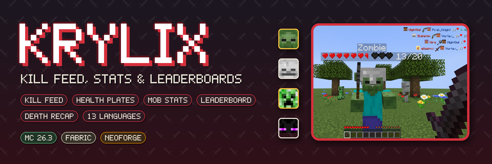

[](https://www.minecraft.net/)
[](https://fabricmc.net/)
[](https://neoforged.net/)
[](https://adoptium.net/)
[](LICENSE)
[](CHANGELOG.md)
[](docs/api/README.md)

[](https://modrinth.com/mod/krylix)
[](https://www.curseforge.com/minecraft/mc-mods/krylix)

**A kill feed, health plates over whatever you aim at, per-player mob stats<br>and an all-time PvP leaderboard — for Fabric and NeoForge, with an addon API.**

[Kill Feed](#kill-feed) • [Health Plates](#health-plates) • [Mob Stats](#mob-stats) • [Leaderboard](#leaderboard) • [Death Recap](#death-recap) • [Config & Keys](#config--keys) • [Languages](#languages) • [Servers](#servers) • [Addon API](#addon-api) • [Installation](#installation)

</div>

---

## About

**Krylix** brings the combat information you are used to from shooters into Minecraft, drawn in the game's own style: who killed whom and with what, how much health your target has left, how many of each mob you have taken down in this world, and who is on top of the server — all time.

Everything is one key away and stays out of the way when you don't need it.

**Languages:** English, Русский, Беларуская, Українська, Polski, Deutsch, Nederlands, Svenska, Español, Português (Brasil), Français, 简体中文, 繁體中文

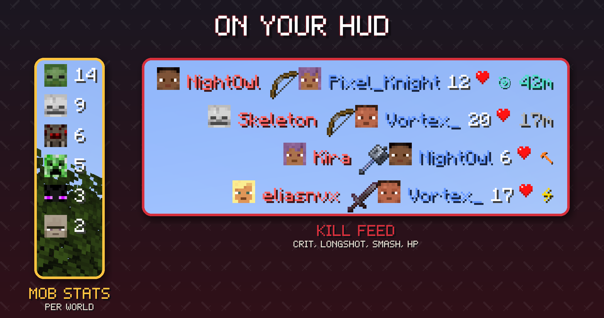

---

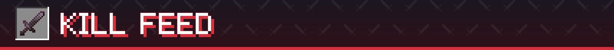

## Kill Feed

Every player death on the server appears in the top-right corner for a few seconds:

- **Killer and victim heads** — real player skins with the hat layer, or the mob's own face for 43 mobs
- **The weapon** that did it and **the killer's health** at that moment
- **Badges** — a critical hit, a mace smash, and a long shot (30+ blocks with a bow or trident) with the distance
- **Knock-offs count.** Push someone off a cliff, into lava or into the void and the kill is yours; the feed shows what finished them (a feather for the fall, a lava bucket for lava)
- **Pets fight for their owner** — a tamed wolf's kill goes to you, with the wolf's spawn egg as the weapon
- **Falls, fire, drowning, freezing, anvils and other environmental deaths** and self-kills get a clean one-sided row, each with its own icon
- Rows fade out after 15 seconds; up to 5 at once (both configurable)
- Servers can limit the feed to players **in the same dimension**

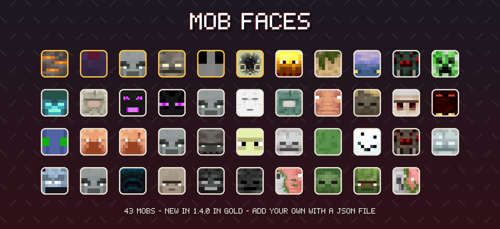

Every mob face is a small JSON file, so **resource packs can restyle them and modpacks can add faces for modded mobs** — no code needed ([format](docs/api/README.md#mob-faces-without-code)).

---

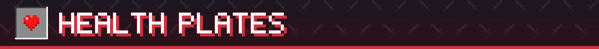

## Health Plates

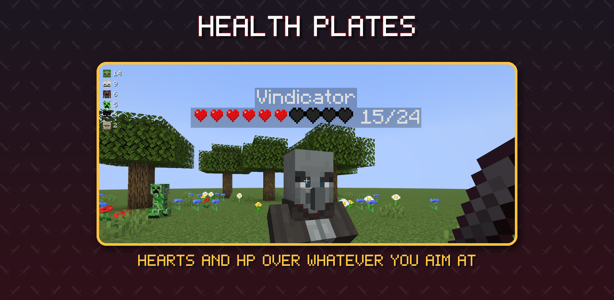

Aim at any living entity — up to 48 blocks away — and a plate appears over its head: its name, the game's own **heart sprites** and the exact **HP / max HP**. Plates are drawn full-bright, so they stay readable in caves, under trees and at night. They follow the game's own nametag rules — invisible players, team visibility, sneaking players far away, the server's nametag distance and F1 — so a plate never shows a name the game hides. Press **H** to hide them.

---

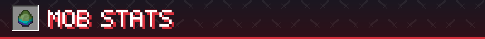

## Mob Stats

A compact panel in the top-left corner counts the hostile mobs **you** have killed in this world, most-killed first, each with its face. Every player has their own counts; they are kept by the server, survive restarts and are sent to you when you join. Press **J** to hide it.

---

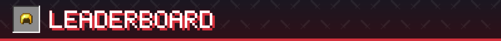

## Leaderboard

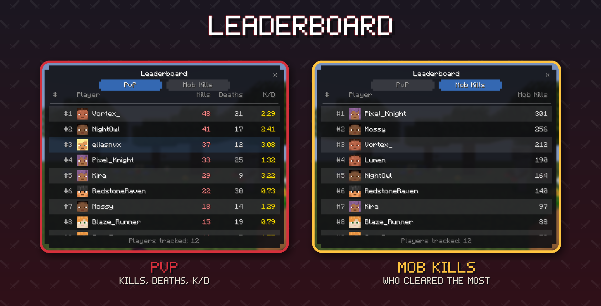

Press **U** for the leaderboard — a proper screen, not a wall of chat:

- **PvP** — kills, deaths and K/D in separate columns, for every player the server has seen
- **Mob Kills** — players ranked by how many mobs they have killed
- Player faces, your own row highlighted, smooth scrolling, 60 players per page with page controls at the bottom
- All-time per world, stored on the server and sent only when you open the screen, so it costs nothing while you play

---

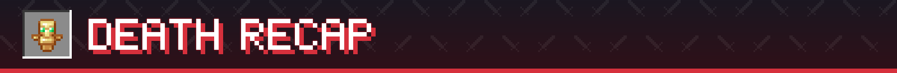

## Death Recap

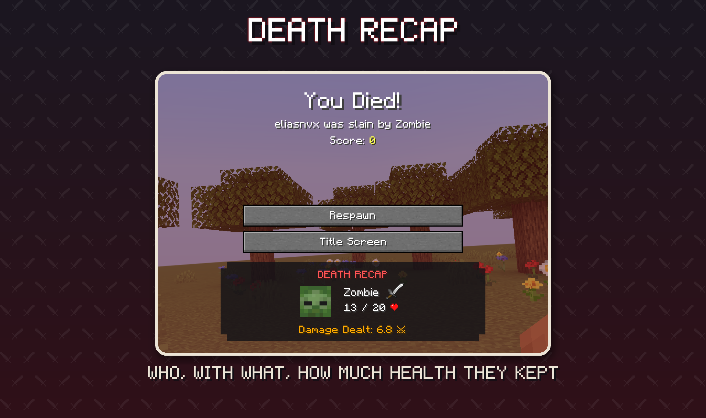

When you die, a card under the Respawn button shows **who killed you**, their face, how much **health they had left**, the **damage you dealt them** in the fight, and the same crit / smash / long-shot badges as the feed.

---

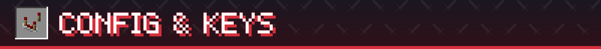

## Config & Keys

| Key | Action |
|---|---|
| **K** | Show / hide the kill feed |
| **J** | Show / hide the mob stats panel |
| **U** | Open the leaderboard |
| **H** | Show / hide health plates |

All keys can be rebound in *Options → Controls*, category *Krylix*. (Before 1.4 the defaults were L and O, which clash with Minecraft's Advancements and Friends keys.) Settings are in game — *Mods → Krylix → Config* (on Fabric through [Mod Menu](https://modrinth.com/mod/modmenu)) — and in `config/krylix.json5`:

| Setting | Default | What it does |
|---|---|---|
| `displaySeconds` | `15` | how long a kill feed row stays on screen |
| `maxEntries` | `5` | kill feed rows at once |
| `killFeedEnabled` / `mobStatsEnabled` / `healthIndicatorEnabled` | `true` | the same switches as K / L / H |
| `mobStatsMaxEntries` | `8` | rows in the mob stats panel |
| `restrictBroadcastToSameDimension` | `false` | server: send kills only to players in the same dimension |
| `healthBarStyle` | `HEARTS` | the health plate's bar: `HEARTS`, `BLOCKS`, `ASCII`, `DOTS` or `NUMBER_ONLY` |

**Commands**

| Command | Where | What it does |
|---|---|---|
| `/krylix toggle` | server, op | turn the kill feed on or off for everyone |
| `/krylix status` | server, op | show whether the feed is on and how many players are tracked |
| `/krylixclient hud toggle \| clear \| count` | client | the same as **K**; clear your feed; count its rows |

---

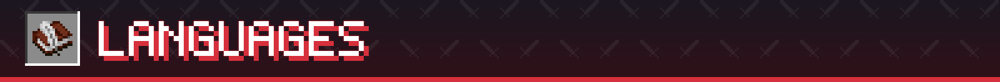

## Languages

Krylix is fully translated into **13 languages**: English, Russian, Belarusian, Ukrainian, Polish, German, Dutch, Swedish, Spanish, Brazilian Portuguese, French, Simplified Chinese and Traditional Chinese (Taiwan). Switch the game language and every screen, key name and message follows.

---

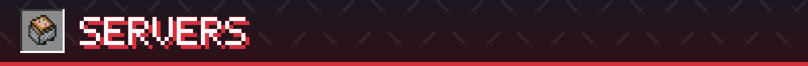

## Servers

- Install Krylix **on the server and on every client**. The server decides what counts as a kill, keeps the statistics and sends the feed, the stats and the recap; health plates are drawn by the client alone.
- Players **without** Krylix can still join a Krylix server (and Krylix players can join vanilla servers) — they simply don't see the feed.
- Statistics are saved inside the world folder, so they move with the world. Worlds from Krylix 1.3 keep their numbers.
- `/krylix toggle` switches the feed off for everyone until the next restart; `restrictBroadcastToSameDimension` keeps kills in their own dimension.

---

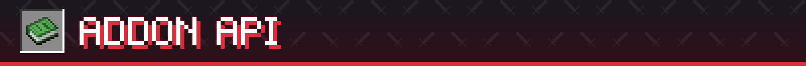

## Addon API

Other mods can plug into Krylix — the way addons work for Jade or Thermal. The API is a small separate artifact (`com.eliasnvx:krylix-api`); it ships inside Krylix, so players install nothing extra.

```java
@RegisterKrylixAddon                                   // NeoForge; on Fabric: the "krylix" entrypoint
public final class MyAddon implements KrylixAddon {
    @Override
    public void onInitialize(KrylixApi api) {
        // A kill in my minigame arena: no feed row, not counted
        api.events().addListener(KillEvent.class, event -> {
            if (Arena.contains(event.victim())) {
                event.setBroadcast(false);
                event.setRecordStats(false);
            }
        });
    }
}
```

- **Kill credit** — decide who gets a kill (turrets, summoned minions, friendly fire)
- **Kill events** — hide a kill from the feed, keep it out of the statistics, change the weapon icon and the badge
- **Statistics** — react to every kill and death (rewards, Discord webhooks), read everyone's saved numbers
- **Client** — hide feed rows, add mob faces from code, supply health numbers for bosses and custom health systems

Guide: [`docs/api/README.md`](docs/api/README.md). A working addon for both loaders: [`example-addon`](example-addon).

---

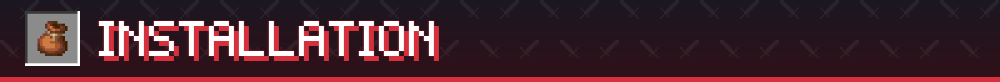

## Installation

| | Fabric | NeoForge |
|---|---|---|
| Minecraft | 26.3 | 26.3 |
| Loader | [Fabric Loader](https://fabricmc.net/) 0.19.5+ and [Fabric API](https://modrinth.com/mod/fabric-api) 0.161+ | [NeoForge](https://neoforged.net/) 26.3.0.33-beta+ |
| [Cloth Config](https://modrinth.com/mod/cloth-config) | required | required |
| [Mod Menu](https://modrinth.com/mod/modmenu) | optional (Config button) | — |

1. Install the loader, Fabric API (on Fabric) and Cloth Config for Minecraft 26.3.
2. Download Krylix from [Modrinth](https://modrinth.com/mod/krylix), [CurseForge](https://www.curseforge.com/minecraft/mc-mods/krylix) or the [releases](https://github.com/eliasnvx/Krylix/releases).
3. Drop the `.jar` into `mods` — on the client **and** the server.

Older Minecraft versions: Krylix 1.3.1 for 26.1.2 is on the same pages. Everything new in 1.4.0 comes to the other versions next.

---

## Development

```bash
./gradlew build                                         # Fabric and NeoForge jars, unit tests
./gradlew :fabric:runClient                             # dev client (Fabric)
./gradlew :neoforge:runClient                           # dev client (NeoForge)
./gradlew :example-addon-fabric:runClient               # dev client with the example addon
./gradlew :fabric:runClientGameTest                     # client GameTests in a real game (health plates, addon API)
KRYLIX_DOCS_SHOTS=1 ./gradlew :fabric:runClientGameTest # + README screenshots
python3 tools/docs/make_readme_images.py                # banner, headers and galleries in docs/images
./gradlew :api:publishToMavenLocal                      # the API jar for local addon work
```

Modules: `api` (public addon API) / `common` (all the logic) / `fabric` / `neoforge` / `example-addon`. Java 25, Mojang names, built with the Architectury Gradle plugin. Changes: [`CHANGELOG.md`](CHANGELOG.md).

The pictures on this page are real in-game screenshots taken by a client GameTest (`fabric/src/gametest`); the banner, headers and frames are drawn by `tools/docs/make_readme_images.py`.

---

## Credits & License

- **Author:** [eliasnvx](https://github.com/eliasnvx)
- **Built with:** [Cloth Config](https://github.com/shedaniel/cloth-config)

[MIT](LICENSE) © eliasnvx

<div align="center">

**Made for everyone who wants to know who got the last hit**

</div>
